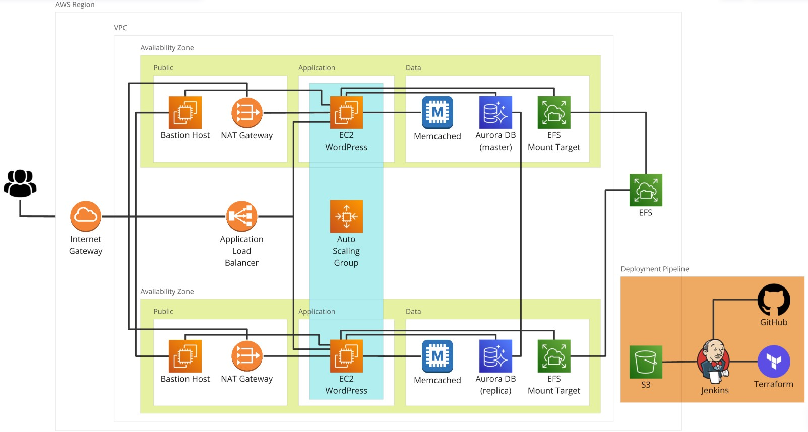

# WordPress in AWS - Infrastruttura scalabile con Terraform e Jenkins

## Overview
Questo progetto fornisce un'infrastruttura scalabile per **WordPress** in **AWS**, disegnata per scalare in modo automatico in base al traffico, utilizzando EC2 con Auto Scaling Groups, Load Balancer, Aurora, Memcached ed EFS. Il provisioning e la gestione dell'infrastruttura sono automatizzati tramite **Terraform**, mentre il processo di deployment è gestito tramite una pipeline **Jenkins** per la continuous integration e il continuous deployment (CI/CD).

### Quick view dei componenti chiave:
- **Istanze EC2**: per l'hosting dell'applicazione WordPress.
- **Auto Scaling Group**: per scalare automaticamente le istanze EC2 in base al traffico.
- **Amazon Aurora**: per avere un database relazionale scalabile e ad alte prestazioni.
- **Elastic File System (EFS)**: per avere uno spazio di archiviazione condiviso tra tutte le istanze EC2.
- **Application Load Balancer (ALB)**: per instradare il traffico verso le istanze EC2, eseguire controlli di integrità a livello di applicazione e gestire la scalabilità delle risorse.
- **Pipeline Jenkins**: per automatizzare il deployment dell'applicazione WordPress in AWS utilizzando Terraform come strumento IaC.

## Diagramma dell'architettura


### Componenti dell'architettura e flusso:

1. **Richieste utente**: le richieste HTTP degli utenti vengono instradate tramite un **Application Load Balancer (ALB)** verso le istanze EC2 che ospitano WordPress.
2. **Auto Scaling Group**: le istanze EC2 vengono scalate dinamicamente in base al carico di traffico.
3. **EFS**: tutte le istanze EC2 condividono un file system comune per archiviare i contenuti per WordPress (media, plugin, temi) utilizzando **Amazon Elastic File System (EFS)**.
4. **Aurora**: le istanze WordPress si connettono al database gestito da **Amazon Aurora**.
5. **Memcached**: Memcached viene utilizzato per memorizzare in cache le query al database, gli oggetti e le sessioni, migliorando così le prestazioni di WordPress.
6. **Terraform**: utilizzato come strumento IaC per automatizzare il provisioning di tutti i componenti dell'infrastruttura (EC2, ALB, Aurora, EFS, etc.).
7. **Pipeline Jenkins**: automatizza l'esecuzione di `terraform plan`, `terraform apply` e `terraform destroy` per gestire il deployment dell'applicazione WordPress, recuperando il codice da GitHub e memorizzando l'output di Terraform in S3.

## Requisiti

- **Account AWS** con permessi per creare risorse EC2, EFS, Aurora, Memcached, ALB, Auto Scaling group, IAM e S3.
- **Terraform** installato localmente o sul server Jenkins.
- **AWS CLI** installato e configurato su Jenkins per interagire con i servizi AWS.
- **Server Jenkins** configurato con le credenziali AWS necessarie per il deployment.
- **Pipeline Jenkins** configurata su Jenkins per orchestrare il processo di deployment (da creare con il file Jenkinsfile nella repository).
- **Repository Git** contenente il codice Terraform per WordPress e la definizione della pipeline Jenkins.

## Configurazione dell'infrastruttura AWS

L'intera infrastruttura viene creata utilizzando Terraform, di seguito i principali stage per il deployment delle risorse.

### 1. **Creare le istanze EC2**
   - Creare un **Launch Template** per le istanze EC2.
   - Configurare le istanze con il software richiesto (Apache, WordPress, etc.).
   - Configurare **Amazon EFS** per archiviare i file di WordPress in modo che possano essere accessibili da tutte le istanze.

### 2. **Configurare Amazon Aurora**
   - Creare **un'istanza Aurora compatibile con MySQL** (MariaDB).
   - Configurare i security group per permettere alle istanze EC2 di connettersi al database.
   - Assicurarsi che WordPress possa connettersi al database modificando il file `wp-config.php` durante il processo di deployment.

### 3. **Configurare EFS per lo Storage Condiviso**
   - Creare un **file system EFS** per configurare lo storage condiviso per WordPress.
   - Montare il file system EFS su tutte le istanze EC2 per archiviare il contenuto di WordPress.

### 4. **Auto Scaling Group e Application Load Balancer**
   - Creare un **Auto Scaling Group (ASG)** per gestire la scalabilità delle istanze EC2 in base al carico di traffico.
   - Utilizzare le metriche di **CloudWatch** (come l'utilizzo della CPU) per attivare le politiche di scalabilità.
   - Collegare le istanze EC2 a un **Application Load Balancer (ALB)** per distribuire il traffico tra le istanze.

## Configurazione della Pipeline Jenkins

### 1. **Installare i plugin richiesti e configurare Git**
   Assicurarsi che siano installati i seguenti plugin su Jenkins:
   - AWS CLI plugin
   - Terraform plugin
   - Credenziali Git configurate per il pull del codice

### 2. **Creare la pipeline Jenkins**

Creare una pipeline Jenkins dal **Jenkinsfile** nel repository Git, di seguito una panoramica delle fasi:

1. **Checkout del codice**: Clonare il repository.
2. **Terraform init**: Eseguire terraform init nella cartella di deployment di Terraform.
3. **Terraform plan**: Creare un piano per il deployment dell'applicazione WordPress.
4. **Terraform apply**: Eseguire il deployment dell'applicazione WordPress in AWS.
5. **Terraform destroy**: Distruggere l'applicazione WordPress in AWS.
6. **Memorizzare l'output in S3**: Memorizzare i file di output di Terraform in un bucket S3.
7. **Clean up**: Eventuali passaggi post-deployment come clean-up o logging.

### 3. **Eseguire la pipeline Jenkins**
Eseguire la pipeline Jenkins per eseguire il deployment di Terraform selezionando una action. Di seguito un riepilogo dei parametri della pipeline Jenkins:
- REPO_URL
- BRANCH
- WORDPRESS_VERSION (default value: "latest")
- ACTION (plan, apply, destroy)

## Directory structure
```bash
├── Jenkinsfile
├── README.md
├── README_ITA.md
├── wordpress_aws_architecture.jpg
└── terraform_files
    ├── modules
    │   ├── application
    │   |   ├── alb.tf
    │   |   ├── application-out.tf
    │   |   ├── application-var.tf
    │   |   ├── asg.tf
    │   |   └── install_wordpress.sh
    │   ├── data
    │   |   ├── data-out.tf
    │   |   ├── data-var.tf
    │   |   ├── efs.tf
    │   |   ├── memcached.tf
    │   |   └── rds.tf
    │   └── networking
    │       ├── networking-out.tf
    │       ├── networking-var.tf
    │       └── vpc.tf
    ├── main.tf
    └── variables.tf
```
